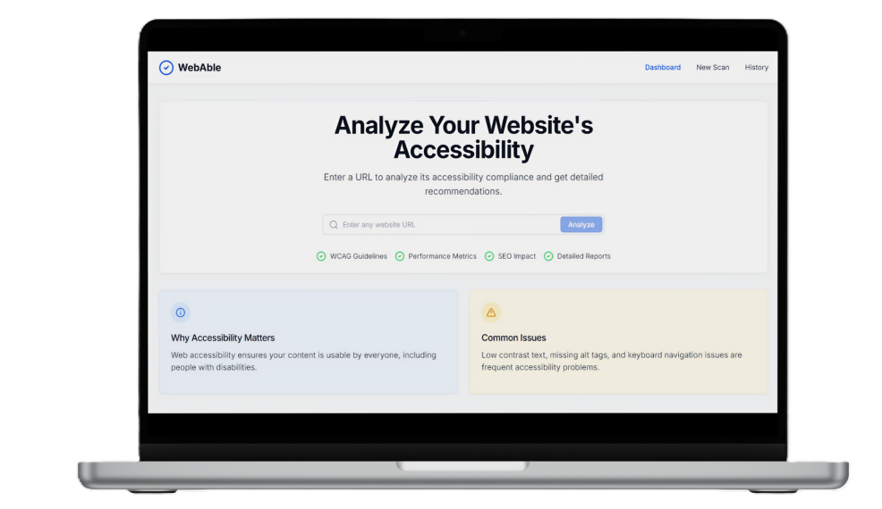

# 💻 WebAble 

 A tool designed to evaluate the accessibility of websites and web applications. It helps developers identify and fix common accessibility issues to ensure their content is usable by everyone, including people with disabilities.

----

## ✨ Core Functionality

- **Automated Accessibility Scanning** – Analyze any website using Lighthouse and axe-core.
- **Comprehensive Reports** – Detailed insights with WCAG compliance and issue breakdowns.
- **Historical Analysis** – Track previous scans and accessibility improvements.
- **Data Management** – Delete scan data when needed.
- **User Authentication** – Secure login and registration system.

---

## 🛠️ Tech Stack

| Category      | Technology                                   |
|---------------|----------------------------------------------|
| Frontend      | React, Typescript, Tailwind CSS              |
| Backend       | Flask for API processing                     |
| Database      | MongoDB                                      |
| APIs          | Lighthouse and axe-core                      |
| Authentication | Firebase                                    |

---
## 🤝 Contributing

Contributions are welcome! Feel free to open issues or submit pull requests to improve the project.

1. Fork the repo
2. Create your branch (`git checkout -b feature/my-feature`)
3. Commit your changes (`git commit -m 'Add feature'`)
4. Push to the branch (`git push origin feature/my-feature`)
5. Open a Pull Request

