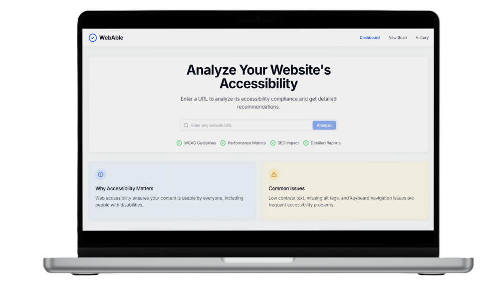

# 🌐 WebAble – Website Accessibility Analyzer

WebAble is an **open-source accessibility analysis tool** designed to evaluate the accessibility of websites and web applications. It helps developers identify accessibility issues and improve compliance with **WCAG standards**, ensuring that digital content is usable by everyone — including people with disabilities.

The platform automatically scans websites and generates **detailed accessibility reports**, enabling developers to quickly detect and fix issues affecting usability.

# 📌 Problem Statement

Millions of websites still fail to meet accessibility standards, making them difficult or impossible to use for people with disabilities. Developers often lack tools that provide **clear, actionable accessibility insights during development**.

WebAble addresses this problem by providing:

- Automated accessibility testing
- Detailed issue reports
- Historical tracking of accessibility improvements
- Developer-friendly analysis tools

This helps teams build **inclusive and accessible web applications**.

---

# 🚀 Project Overview

WebAble performs automated accessibility testing using **Lighthouse** and **axe-core** to scan a given website and generate structured reports.

The system provides:

- Accessibility issue detection
- WCAG compliance insights
- Historical report tracking
- Dashboard visualization for accessibility improvements

---

# ✨ Features

### 🔍 Automated Accessibility Scanning
Analyze any website using **Lighthouse** and **axe-core** to detect accessibility violations.

### 📊 Detailed Accessibility Reports
Generate comprehensive reports including:
- WCAG compliance
- Accessibility issue breakdown
- Severity levels
- Improvement suggestions

### 🕒 Historical Scan Tracking
Store and review previous scan results to track accessibility improvements over time.

### 🗂️ Data Management
Users can manage or delete scan reports when required.

---

# 🛠️ Tech Stack

| Category | Technology |
|--------|-------------|
| Frontend | React, TypeScript, Tailwind CSS |
| Backend | Flask (Python) |
| Database | MongoDB |
| Accessibility Tools | Lighthouse, axe-core |

---

# 📸 Application Preview



---

## Getting Started

### Frontend Setup

1. Install dependencies:
   ```
   npm install
   ```

2. Start the development server:
   ```
   npm run dev
   ```

### Backend Setup

1. Navigate to the backend directory:
   ```
   cd backend
   ```

2. Install Python requirements:
   ```
   pip install -r requirements.txt
   ```
3. Create a `.env` file
Inside the `backend` folder, create a `.env` file and add:
```env
MONGO_URI=your_mongodb_connection_string
```

> ⚠️ Replace with your actual MongoDB Atlas connection string.  
> Make sure your MongoDB Atlas cluster is set up and your IP is whitelisted.

4. Start the Flask server:
   ```
   python app.py
   ```

---


## API Endpoints

- **POST /api/scan** - Initiate a website accessibility scan and saves result to MongoDB.
- **GET /api/reports/:id** - Fetches a scan report by either scan ID or URL.
- **GET /api/reports** - Get a list of all scan reports.

---

## 📂 Project Structure
```
WebAble
│
├── backend/                    # Flask backend and scanning services
│   ├── app.py
│   ├── server.js
│   ├── scan_service.js
│   └── requirements.txt
│
├── public/                     # Static assets
│   └── Dashboard.png
│
├── src/                        # Frontend source code
│   ├── components/
│   ├── hooks/
│   ├── pages/
│   ├── services/
│   ├── utils/
│   ├── App.tsx
│   └── main.tsx
│
├── index.html
├── package.json
└── README.md
```

---

# 🤝 Contributing 
We welcome contributions from the community!
    
## How to Contribute 

### 1. Fork the repository

### 2. Create a feature branch 
```
git checkout -b feature-name
```
### 3. Commit your changes
```
git commit -m "Add new feature"
```

### 4. Push the branch 
```
git push origin feature-name 
```

### 5. Open a Pull Request 🚀 
    
Contributors can help with:

*   Bug fixes
    
*   UI improvements
    
*   Accessibility rule enhancements
    
*   Performance optimizations
    
*   Documentation improvements

---

## 👩‍💻 Maintainer

**Harshika Rathod**
Project Maintainer and Developer of WebAble.

---

## ⭐ Support the Project

If you find this project useful, consider giving it a star ⭐ on [GitHub](https://github.com) to support the project and help others discover it.
